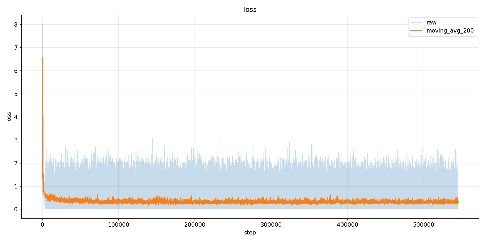
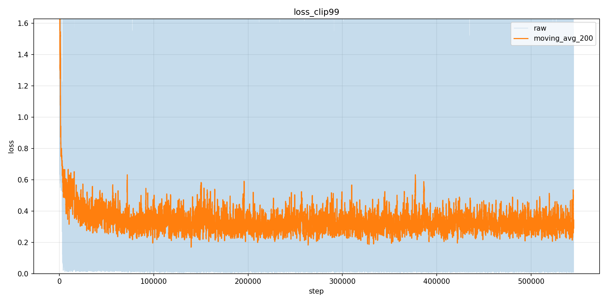
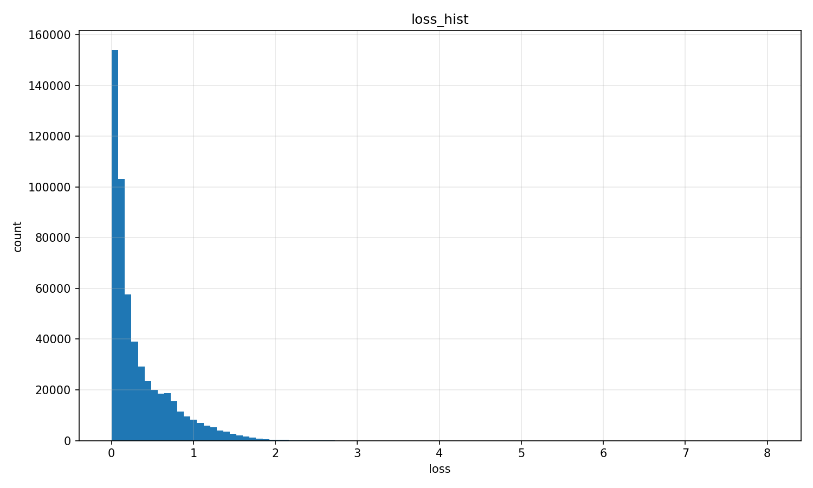
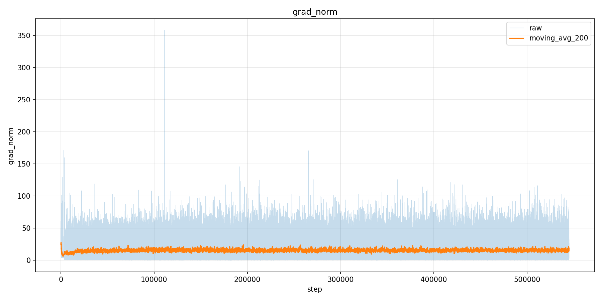
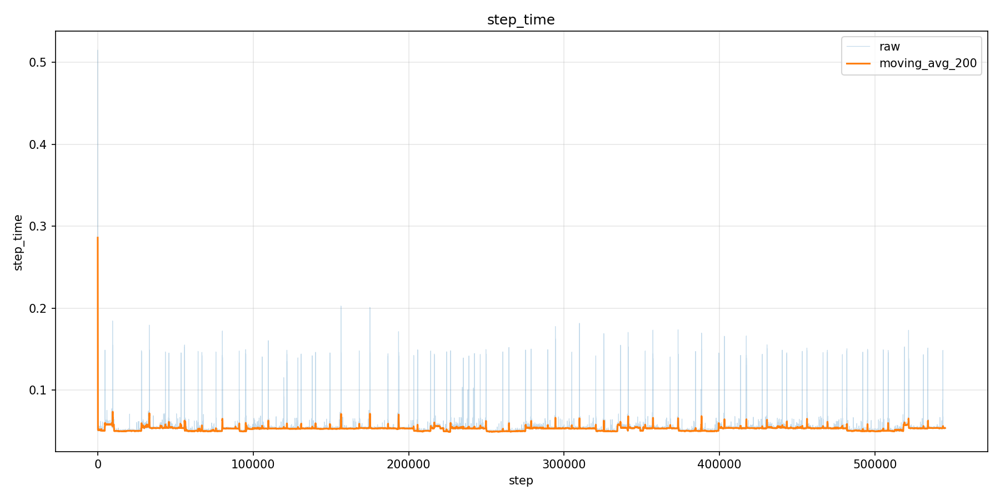
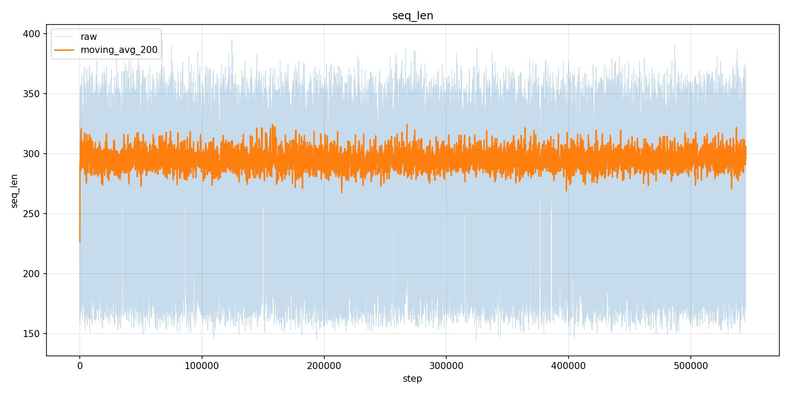
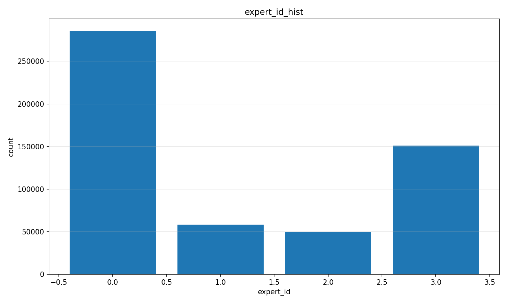
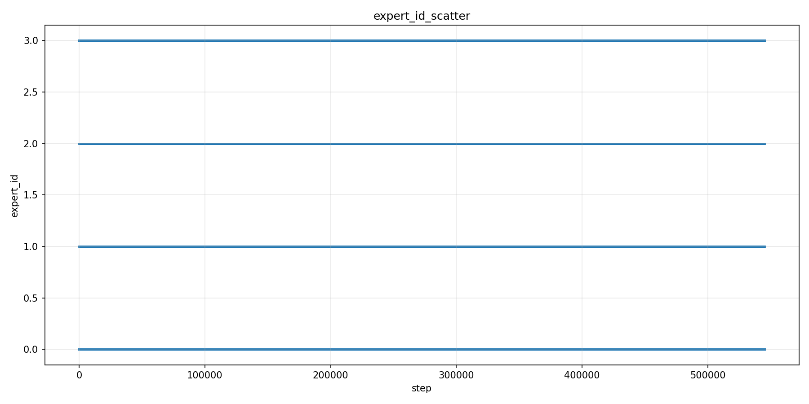
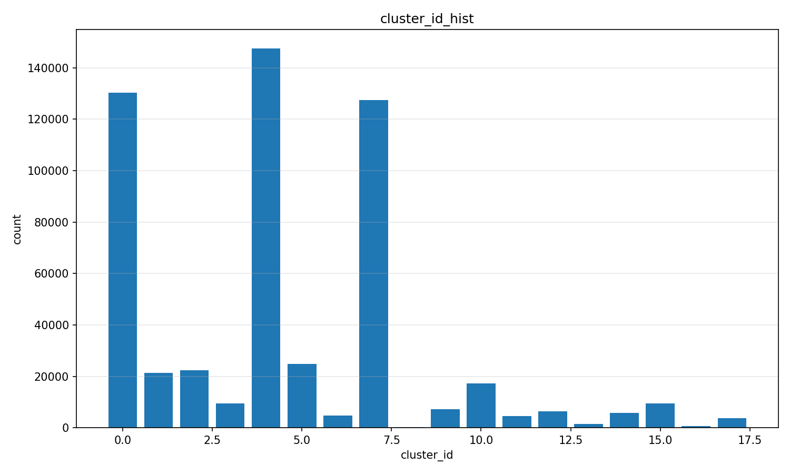
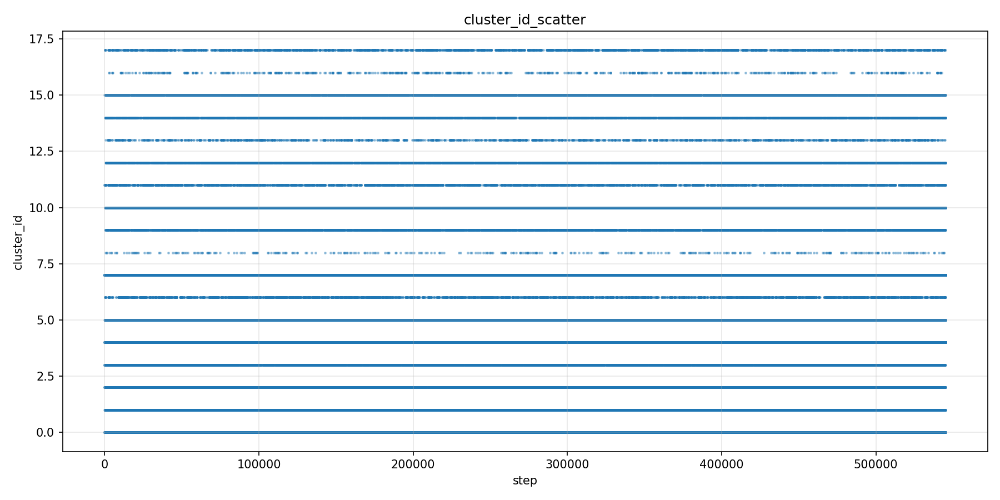

# MovieLens-1M MoCLE Full-Set 1-Epoch Run

这份 README 记录本目录保存的一次 MovieLens-1M 推荐任务训练结果：我把 MovieLens-1M 处理成 instruction tuning 格式，并用 Llama-3.2-1B 作为基座，在推荐样本上跑了 MoCLE-style 多 LoRA expert 训练。

需要先说明一个命名细节：本实验目录名里的 `full` 指使用完整训练集并跑完整一轮，不是 `train_mode=full` 的全模型参数微调。从 `train_summary.json` 看，本次实际训练模式是 `train_mode=mocle`，可训练参数为 6815744，占总参数 1242630144 的约 0.55%。

## 我做了什么

本实验完成了下面这条主线：

```text
MovieLens-1M 原始 ratings/movies/users 数据
  -> 构造 next-movie recommendation instruction 样本
  -> 每条样本保留 task_type，并令 cluster_id = task_type
  -> 用 cluster_id % 4 路由到 4 个 LoRA expert
  -> 单卡训练 Llama-3.2-1B + MoCLE LoRA experts
  -> 保存训练日志、JSONL 指标、TensorBoard、曲线图和阶段 checkpoint
```

推荐任务本身被转成四选一文本生成任务。每条样本包含用户历史电影、4 个候选电影和正确答案字母 `A/B/C/D`。模型看到 instruction 和 input 后，只需要生成正确候选字母。

MoCLE 部分没有改变推荐样本的文本格式，只额外读取样本元信息 `cluster_id` 来决定训练哪个 expert。当前 v0 规则很直接：

```text
cluster_id = task_type
expert_id = cluster_id % num_experts
active_adapter = expert_{expert_id}
```

其中 `task_type` 来自目标电影的第一个 genre，MovieLens genre 被映射到 0-17 的整数。

## 关键代码

相关代码在源码目录：

```text
recommendation/movielens1m/preprocess_ml1m.py
recommendation/movielens1m/dataset.py
recommendation/movielens1m/train_single_gpu.py
recommendation/movielens1m/run_train_single_gpu.sh
recommendation/movielens1m/plot_train_metrics.py
```

主要职责：

- `preprocess_ml1m.py`：读取 MovieLens-1M 原始数据，过滤正反馈序列，构造 instruction/input/output 样本，并写入 `cluster_id`。
- `dataset.py`：把 instruction 样本 tokenization 成 causal LM 输入，labels 只监督答案部分，同时在 batch 中保留 `cluster_id`。
- `train_single_gpu.py`：加载 Llama-3.2-1B，创建多个 LoRA adapter，在训练循环中按 `cluster_id` 切换 expert。
- `run_train_single_gpu.sh`：封装单卡启动参数。
- `plot_train_metrics.py`：读取 `train_metrics.jsonl`，去重 step 后生成 loss、grad norm、seq len、step time、expert/cluster 分布图。

## 数据怎么做的

原始数据来自：

```text
/vepfs-cnbja62d5d769987/liushaokun/sys_work/test_use_lsk/lora_trl/data/ml-1m
```

完整训练集保存在：

```text
data/movielens1m_train_full/train.json
data/movielens1m_train_full/valid.json
data/movielens1m_train_full/test.json
```

本次训练实际读取：

```text
data/movielens1m_train_full/train.json
```

训练样本数为 545102。预处理逻辑的关键参数如下：

- `min_rating=4`：只把评分大于等于 4 的电影当作正反馈。
- `min_seq_len=5`：用户正反馈序列至少需要 5 部电影。
- `max_history=10`：每条样本最多保留最近 10 部历史电影。
- `num_candidates=4`：每个问题提供 4 个候选电影。
- 每个用户最后两条样本分别进入 valid/test，其余进入 train。
- 负样本从用户历史和目标电影之外随机采样。

单条训练样本的核心字段包括：

```text
instruction
input
output
task_type
cluster_id
user_id
history_movie_ids
target_movie_id
candidate_movie_ids
```

## 训练怎么跑的

本次运行环境记录在 `run_env.txt`：

```text
PYTHON_BIN=/home/liushaokun/miniconda3/envs/lavispy310/bin/python
MODEL_PATH=/vepfs-cnbja62d5d769987/liushaokun/models/Llama-3.2-1B
TRAIN_FILE=data/movielens1m_train_full/train.json
CUDA_VISIBLE_DEVICES=1
MAX_STEPS=545102
MAX_TRAIN_SAMPLES=545102
LOGGING_STEPS=100
SAVE_STEPS=10000
NUM_EXPERTS=4
OUTPUT_DIR=outputs/movielens1m_mocle_full_1epoch
TENSORBOARD_LOG_DIR=outputs/movielens1m_mocle_full_1epoch/tb_logs
```

等价启动方式：

```bash
cd /vepfs-cnbja62d5d769987/liushaokun/sys_work/MoCLE-main

CUDA_VISIBLE_DEVICES=1 \
TRAIN_FILE=data/movielens1m_train_full/train.json \
OUTPUT_DIR=outputs/movielens1m_mocle_full_1epoch \
TENSORBOARD_LOG_DIR=outputs/movielens1m_mocle_full_1epoch/tb_logs \
MAX_TRAIN_SAMPLES=545102 \
MAX_STEPS=545102 \
LOGGING_STEPS=100 \
SAVE_STEPS=10000 \
NUM_EXPERTS=4 \
bash recommendation/movielens1m/run_train_single_gpu.sh \
  2>&1 | tee outputs/movielens1m_mocle_full_1epoch/train.log
```

训练细节：

- 基座模型：`/vepfs-cnbja62d5d769987/liushaokun/models/Llama-3.2-1B`
- 设备：单卡 NVIDIA L20，`CUDA_VISIBLE_DEVICES=1`
- batch size：1
- max sequence length：512
- learning rate：`1e-5`
- dtype：`bfloat16`
- optimizer：`AdamW`
- train mode：`mocle`
- experts：4 个 LoRA adapter，`expert_0` 到 `expert_3`
- LoRA target modules：`q_proj,k_proj,v_proj,o_proj`
- LoRA rank：8
- LoRA alpha：16
- LoRA dropout：0.05
- logging：每 100 step
- checkpoint：每 10000 step

训练 loop 每一步做的事情：

```text
1. 从 batch 中取 cluster_id。
2. 计算 expert_id = cluster_id % 4。
3. 调用 model.set_adapter("expert_{expert_id}")。
4. 只把 input_ids/attention_mask/labels 传入 Llama forward。
5. loss backward，AdamW 更新当前可训练 LoRA 参数。
6. 写 train_metrics.jsonl 和 TensorBoard scalar。
7. 到 save_steps 时保存所有 expert adapter 和 tokenizer。
```

## 本次结果

这一节直接给出本次训练的关键图和关键指标。指标来源是 `train_metrics.jsonl` 和 `train_summary.json`；由于 JSONL 里有少量重复 step，统计时按 step 去重并保留最后一条记录。

### 结果总览

| 项目 | 数值 |
|---|---:|
| 训练样本数 | 545102 |
| 完成 step | 545102 / 545102 |
| 原始 metrics 行数 | 545658 |
| 去重后 metrics 行数 | 545102 |
| 总耗时 | 29531.17 秒，约 8.20 小时 |
| 平均 step time | 0.052917 秒 |
| GPU | NVIDIA L20 |
| 训练模式 | `mocle` |
| expert 数量 | 4 |
| 总参数量 | 1242630144 |
| 可训练参数量 | 6815744 |
| 可训练参数占比 | 约 0.55% |
| checkpoint 数量 | 54 |
| 最后一个 checkpoint | `checkpoint-step-540000` |
| 训练结束 step | 545102 |

### Loss 曲线



上图是完整训练过程的 loss 曲线，包含 raw 曲线和 moving average。整体看，训练前期 loss 从 6-8 区间快速下降，后续大部分 step 稳定在较低区间。

为了更清楚看主体区间，下面是 99% 分位裁剪后的 loss 图：



loss 分布直方图：



关键 loss 指标：

| 指标 | 数值 |
|---|---:|
| first loss | 6.771822 |
| last loss | 0.244057 |
| min loss | 0.002836 at step 384007 |
| max loss | 8.008473 at step 42 |
| mean loss | 0.342475 |
| median loss | 0.180804 |
| p95 loss | 1.150196 |
| p99 loss | 1.627631 |
| first 100 step avg loss | 6.365857 |
| last 100 step avg loss | 0.352238 |
| first 1000 step avg loss | 2.685774 |
| last 1000 step avg loss | 0.366733 |
| first 10000 step avg loss | 0.822931 |
| last 10000 step avg loss | 0.316744 |

### 训练稳定性

梯度范数：



step time：



序列长度：



训练稳定性指标：

| 指标 | min | median | mean | p95 | p99 | max | last |
|---|---:|---:|---:|---:|---:|---:|---:|
| grad_norm | 0.158100 | 11.282525 | 15.578741 | 40.630817 | 53.862823 | 357.939758 | 21.076851 |
| step_time | 0.048628 | 0.053247 | 0.052917 | 0.056055 | 0.058633 | 0.514898 | 0.053966 |
| seq_len | 144 | 297 | 295.337330 | 333 | 348 | 395 | 297 |
| tokens_per_step | 144 | 297 | 295.337330 | 333 | 348 | 395 | 297 |

说明：

- `step_time` 的最大值出现在第 1 步，主要包含首次 step 的额外开销；后续稳定在约 0.05 秒/step。
- `seq_len` 和 `tokens_per_step` 在当前 batch size 为 1 的设置下数值一致。
- `grad_norm` 存在少量尖峰，但主体分布集中在较低区间。

### Expert 路由分布

expert 分布图：



expert 随 step 的变化：



4 个 expert 的样本量并不均匀，这是由 `cluster_id = task_type` 和 `expert_id = cluster_id % 4` 的规则共同决定的。MovieLens genre 本身分布不均，所以 expert 也会不均衡。

| expert_id | 样本数 | 占比 |
|---:|---:|---:|
| 0 | 285367 | 52.35% |
| 1 | 58566 | 10.74% |
| 2 | 50102 | 9.19% |
| 3 | 151067 | 27.71% |

最后一个 step 的路由状态：

```text
last_cluster_id: 5
last_expert_id : 1
last active expert: expert_1
```

### Cluster 分布

cluster 分布图：



cluster 随 step 的变化：



`cluster_id` 当前直接来自目标电影 genre 对应的 `task_type`，范围是 0-17。完整分布如下：

| cluster_id | 样本数 | 占比 |
|---:|---:|---:|
| 0 | 130414 | 23.92% |
| 1 | 21455 | 3.94% |
| 2 | 22404 | 4.11% |
| 3 | 9574 | 1.76% |
| 4 | 147525 | 27.06% |
| 5 | 24804 | 4.55% |
| 6 | 4704 | 0.86% |
| 7 | 127371 | 23.37% |
| 8 | 363 | 0.07% |
| 9 | 7158 | 1.31% |
| 10 | 17241 | 3.16% |
| 11 | 4618 | 0.85% |
| 12 | 6406 | 1.18% |
| 13 | 1460 | 0.27% |
| 14 | 5753 | 1.06% |
| 15 | 9504 | 1.74% |
| 16 | 659 | 0.12% |
| 17 | 3689 | 0.68% |

从分布可以看出，`cluster_id=4`、`cluster_id=0`、`cluster_id=7` 占比最高，它们路由后主要落到 `expert_0` 和 `expert_3`，因此 expert 负载不均衡是符合当前规则预期的。

### 关键日志结论

训练完成状态来自 `train_summary.json` 和 `train.log`：

```text
TRAIN_COMPLETE steps=545102 last_loss=0.244057 last_lr=1.000000e-05 last_cluster_id=5 last_expert_id=1 last_step_time=0.054s
SINGLE_GPU_TRAIN_OK
```

最后 summary 的核心字段：

```text
completed_steps: 545102
max_steps      : 545102
samples        : 545102
elapsed_seconds: 29531.17
last_loss      : 0.244057
last_grad_norm : 21.076851
last_seq_len   : 297
last_expert_id : 1
last_cluster_id: 5
```

TensorBoard 启动方式：

```bash
/home/liushaokun/miniconda3/envs/lavispy310/bin/tensorboard \
  --logdir outputs/movielens1m_mocle_full_1epoch/tb_logs \
  --host 0.0.0.0 \
  --port 6009
```

TensorBoard 中记录的 scalar：

```text
train/loss
train/lr
train/expert_id
train/cluster_id
train/step_time
train/seq_len
train/grad_norm
train/tokens_per_step
```

## 保存了什么

本目录保存了完整训练产物：

```text
run_env.txt
train.log
train_metrics.jsonl
train_summary.json
tensorboard.log
tensorboard.pid
tb_logs/events.out.tfevents...
plots/*.png
checkpoint-step-10000/
checkpoint-step-20000/
...
checkpoint-step-540000/
```

一共保存了 54 个 checkpoint，最早是 `checkpoint-step-10000`，最后一个阶段 checkpoint 是 `checkpoint-step-540000`。每个 checkpoint 内部保存 4 个 LoRA expert：

```text
expert_0/adapter_model.bin
expert_0/adapter_config.json
expert_1/adapter_model.bin
expert_1/adapter_config.json
expert_2/adapter_model.bin
expert_2/adapter_config.json
expert_3/adapter_model.bin
expert_3/adapter_config.json
tokenizer.json
tokenizer_config.json
special_tokens_map.json
```

注意：训练结束 step 是 545102，但周期性 checkpoint 保存间隔是 10000，所以最后一个保存目录停在 540000。当前脚本只有在传入 `--save_model` 时才会额外保存最终 step 的 model 目录。

## 重新画图

可以用下面命令从 JSONL 重新生成曲线图：

```bash
cd /vepfs-cnbja62d5d769987/liushaokun/sys_work/MoCLE-main

/home/liushaokun/miniconda3/envs/lavispy310/bin/python \
  recommendation/movielens1m/plot_train_metrics.py \
  --jsonl outputs/movielens1m_mocle_full_1epoch/train_metrics.jsonl \
  --outdir outputs/movielens1m_mocle_full_1epoch/plots \
  --smooth 200
```

已生成的图包括：

```text
plots/loss.png
plots/loss_zoom.png
plots/loss_clip99.png
plots/loss_hist.png
plots/grad_norm.png
plots/seq_len.png
plots/step_time.png
plots/expert_id_scatter.png
plots/expert_id_hist.png
plots/cluster_id_scatter.png
plots/cluster_id_hist.png
```

## 当前限制

这次结果主要证明完整训练链路已经跑通，并保存了可复查的训练轨迹。但仍有一些限制：

- 当前 MoCLE-v0 只支持 `batch_size=1`，没有实现一个 batch 内多 expert 分组 forward。
- `cluster_id` 目前直接等于 `task_type`，还不是用户行为或物品表征上的正式聚类结果。
- 当前没有 universal expert 叠加。
- 本目录保存的是训练 loss 和训练过程指标，还没有保存 valid/test 上的推荐准确率、Hit Rate、NDCG 等评估结果。
- 最终 step 545102 没有单独保存 final model 目录；已有最近 checkpoint 是 step 540000。

## 下一步建议

如果继续推进，可以优先做这些事情：

```text
1. 增加 eval 脚本，在 valid/test 上计算 accuracy、Hit@K 或 NDCG。
2. 增加 final-step 保存，避免只依赖最近的周期 checkpoint。
3. 用用户历史 embedding 或 item genre/profile 聚类替换 cluster_id = task_type。
4. 支持 batch 内按 expert 分组 forward，提高训练吞吐。
5. 如果确实需要全模型参数微调，单独用 --train_mode full 跑一版，并和当前 MoCLE LoRA 结果对比。
```
