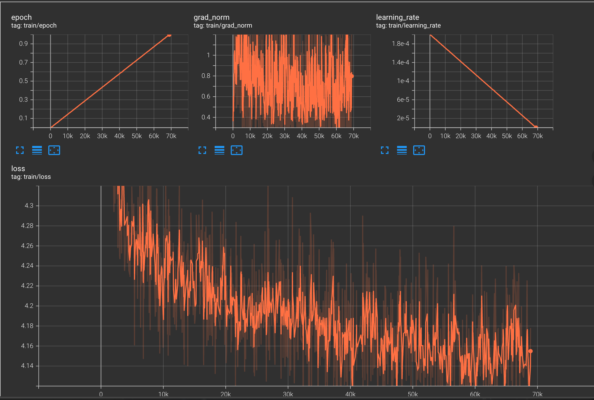
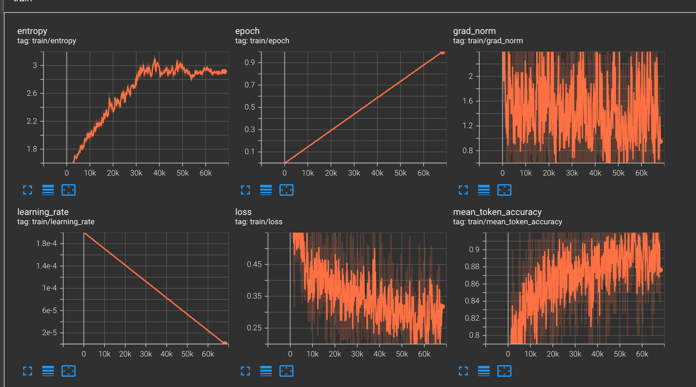

# HydraLoRA on MovieLens-1M

> Adapting **HydraLoRA** and **standard LoRA** to the **MovieLens-1M** recommendation task with a multiple-choice LLM formulation.


---

## Overview

This project reformulates **MovieLens-1M** as a **multiple-choice next-item recommendation task** for language models.

Each sample is constructed as:

- **Input**: user movie history + candidate movies
- **Output**: one correct choice letter (`A`, `B`, `C`, or `D`)

We implement and compare two parameter-efficient fine-tuning methods under the same task setting:

- **Standard LoRA baseline**
- **HydraLoRA adaptation**


---

## Features

- MovieLens-1M preprocessing for LLM-style recommendation
- TRL + PEFT LoRA baseline
- HydraLoRA adaptation to Qwen2.5

---


### Example Prompt

```text
### Instruction:
Given the user's movie preference history, choose the most likely next movie from the candidate list. Return only one letter: A, B, C, or D.

### Input:
User history:
- Girl, Interrupted (1999) | Genres: Drama
- Back to the Future (1985) | Genres: Comedy|Sci-Fi
- Titanic (1997) | Genres: Drama|Romance

Candidate movies:
A. Getting Even with Dad (1994) | Genres: Comedy
B. Cinderella (1950) | Genres: Animation|Children's|Musical
C. General's Daughter, The (1999) | Genres: Drama|Thriller
D. Happy Gilmore (1996) | Genres: Comedy

### Response:
B
```

---

## Project Structure

```text
.
├── data/
│   ├── ml-1m/
│   │   ├── movies.dat
│   │   ├── ratings.dat
│   │   └── users.dat
│   ├── processed_ml1m_mcq/
│   │   ├── train.jsonl
│   │   ├── valid.jsonl
│   │   └── test.jsonl
│   └── hydralora_ml1m/
│       ├── train.json
│       └── valid.json
├── outputs/
│   ├── trl_lora_ml1m_qwen/
│   └── hydralora_ml1m_qwen/
├── preprocess_ml1m.py
├── preprocess_ml1m_for_hydralora.py
├── train_trl_lora_ml1m.py
├── eval_trl_lora_ml1m.py
├── run_lora.sh
├── run_lora_dp.sh
└── README.md
```

---

## Environment

Recommended environment:

- Python 3.10
- PyTorch
- Transformers
- TRL
- PEFT
- TensorBoard
- DeepSpeed (for multi-GPU HydraLoRA training)

Install dependencies as needed, for example:

```bash
pip install torch transformers trl peft tensorboard deepspeed
```

If HydraLoRA introduces version conflicts, check the actual imported package paths and adjust your environment accordingly.

---

## Quick Start

### 1. Download MovieLens-1M

```bash
mkdir -p data
cd data
wget -O ml-1m.zip https://files.grouplens.org/datasets/movielens/ml-1m.zip
unzip -o ml-1m.zip
cd ..
```

Expected files:

```text
data/ml-1m/movies.dat
data/ml-1m/ratings.dat
data/ml-1m/users.dat
```

### 2. Build the standard LoRA dataset

```bash
python preprocess_ml1m.py
```

This generates:

```text
data/processed_ml1m_mcq/train.jsonl
data/processed_ml1m_mcq/valid.jsonl
data/processed_ml1m_mcq/test.jsonl
```

### 3. Train the TRL + PEFT LoRA baseline

```bash
CUDA_VISIBLE_DEVICES=0 python train_trl_lora_ml1m.py
```

### 4. Evaluate the LoRA baseline

```bash
CUDA_VISIBLE_DEVICES=0 python eval_trl_lora_ml1m.py
```

### 5. Build the HydraLoRA dataset

```bash
python preprocess_ml1m_for_hydralora.py
```

This generates:

```text
data/hydralora_ml1m/train.json
data/hydralora_ml1m/valid.json
```

### 6. Train HydraLoRA

Single GPU:

```bash
bash /HydraLoRA-main/test_use_lora/run_lora.sh
```

---

## Methods

### Standard LoRA Baseline

- **Model**: `Qwen/Qwen2.5-0.5B-Instruct`
- **Trainer**: TRL `SFTTrainer`
- **LoRA target modules**:
  - `q_proj`
  - `k_proj`
  - `v_proj`
  - `o_proj`

Typical settings:

```text
lora_rank=8
lora_alpha=16
lora_dropout=0.05
```

### HydraLoRA Adaptation

- **Model**: `Qwen/Qwen2.5-0.5B-Instruct` (usually via a local snapshot path)

HydraLoRA replaces standard LoRA with an asymmetric multi-branch low-rank structure.

In this project, HydraLoRA is adapted to MovieLens-1M by:

- reformulating recommendation as LLM multiple-choice prediction
- reducing unnecessary legacy dependencies where possible
- keeping the same task format as the LoRA baseline for fair comparison

Typical settings:

```text
lora_rank=8
lora_alpha=16
lora_nums=4
```

Trainable modules:

```text
q_proj
k_proj
v_proj
o_proj
```

---
## Training Curves

### HydraLoRA




### Standard LoRA Baseline




### Standard LoRA

The TRL + PEFT LoRA pipeline has been verified on MovieLens-1M:

- preprocessing completed successfully
- training loss decreased normally
- TensorBoard logging worked
- the training loop ran stably

### HydraLoRA

HydraLoRA was successfully adapted and trained on MovieLens-1M.

Example training summary:

```text
epoch                    = 1.0
total_flos               = 335095683GF
train_loss               = 4.2026
train_runtime            = 7:10:08.24
train_samples            = 551130
train_samples_per_second = 21.355
train_steps_per_second   = 2.669
```

---

## Common Issues

### 1. `FileNotFoundError: data/ml-1m/movies.dat`

MovieLens-1M was not downloaded correctly or is in the wrong directory.

### 2. `ModuleNotFoundError: No module named 'peft'`

Install missing dependencies:

```bash
pip install peft
```

### 3. `bf16` / GPU not supported

This is usually caused by:

- CUDA / driver mismatch
- incompatible PyTorch build
- GPU not being detected correctly

Check with:

```bash
python - <<'PY'
import torch
print(torch.__version__)
print(torch.version.cuda)
print(torch.cuda.is_available())
PY
```

### 4. HydraLoRA import conflicts

HydraLoRA may conflict with newer versions of `transformers` or `tokenizers`.

Check which `transformers` package is actually imported:

```bash
python - <<'PY'
import transformers
print(transformers.__file__)
PY
```


## TODO

- [ ] Try Llama 3.x models

---

## Recommended Workflow

### LoRA baseline

1. Download MovieLens-1M
2. Run `preprocess_ml1m.py`
3. Train with `train_trl_lora_ml1m.py`
4. Evaluate with `eval_trl_lora_ml1m.py`

### HydraLoRA

1. Run `preprocess_ml1m_for_hydralora.py`
2. Set the local model snapshot path
3. Run `run_lora.sh` or `run_lora_dp.sh`
4. Check TensorBoard and checkpoints
5. Add evaluation on recommendation metrics

---
